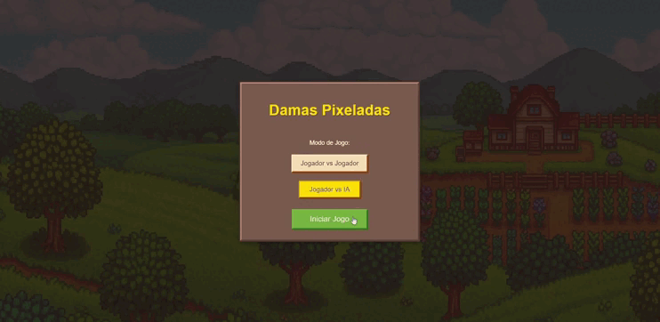

# 🎨♟️ Damas Pixeladas

Bem-vindo(a) ao **Damas Pixeladas**, um jogo de damas online desenvolvido em **HTML**, **CSS** e **JavaScript**. As peças e o tabuleiro possuem um estilo retrô em **pixel art**, trazendo uma experiência nostálgica e divertida.

## 🔗 Acesse o jogo

👉 [Jogar agora!](https://avrilstihler.github.io/Jogo_Damas/)

## 🎮 Funcionalidades

* 🧠 **Modos de jogo:**

  * **Jogador vs Jogador (PvP)** — jogue contra outra pessoa no mesmo dispositivo.
  * **Jogador vs IA (PvM)** — desafie uma inteligência artificial.

* 🎨 **Estilo em pixel art** — peças e tabuleiro com visual retrô.

* 🔊 **Efeitos sonoros** — movimentos, capturas e coroações possuem sons próprios.

* ♟️ **Regras clássicas das damas** — incluindo movimento das damas (rainhas) e capturas obrigatórias.

## 🛠️ Tecnologias 

## 💡 Sobre o projeto

O **Damas Pixeladas** foi desenvolvido com o objetivo de criar uma versão digital, leve e divertida do clássico jogo de damas, com uma pegada estética em pixel art. Ideal para jogar sozinho contra a IA ou para se divertir com um amigo no mesmo dispositivo.

## 📜 Licença

Este projeto é de código aberto e está licenciado sob a [MIT License](LICENSE).

